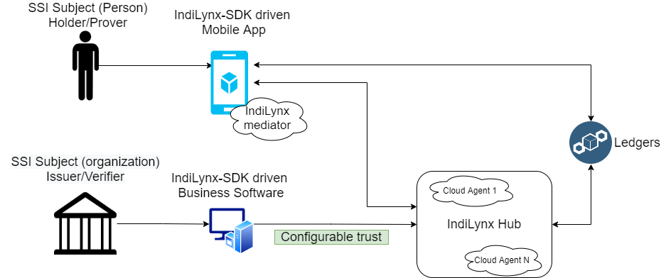

# Настраиваемое доверие между клиентом и облаком

Разработчик может регулировать уровень доверия между серверной инфраструктурой Sirius SSI (Sirius Hub) и своим
программным обеспечением в зависимости от требований бизнеса и безопасности.

* Sirius Hub может работать как полностью доверенный пул агентов SSI, который берет на себя всю работу по управлению
ключами, цифровыми подписями и учетными данными
* Sirius Hub может работать как посредник (медиатор), который не требует к себе доверия, в то время как все 
доверенные операции выполняются на стороне клиента при помощи помощью Sirius SDK
* Возможны промежуточные варианты частичного доверия

Такой подход дает возможность постепенно и безболезненно внедрять решения SSI в существующие информационные системы 
бизнеса и мобильные приложения.