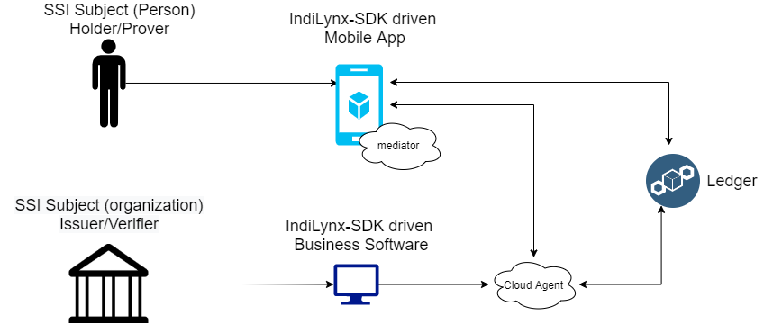

# Основные понятия
В данном разделе раскрываются основные концепции технологии Self Sovereign Identity (SSI) и демонстрируется их практическое
использование в IndiLynx SDK.

Более полное описание технологии SSI можно найти в книге [Self-Sovereign Identity](https://www.manning.com/books/self-sovereign-identity).

## Децентрализованный идентификатор (DID)
В основе технологии SSI лежит понятие децентрализованного идентификатора ([DID](https://www.w3.org/TR/did-core/)).
Например, DID сети [Sovrin](https://sovrin-foundation.github.io/sovrin/spec/did-method-spec-template.html) выглядит
следующим образом
```
did:sov:UNeAfCugwSoeukbBLXdPcU
```

С каждым DID связан т.н. DID Document (DIDDoc), который хранит криптографическую информацию, способную идентифицировать его владельца,
и способы взаимодействия с владельцем DID (например URL-адреса его SSI агентов):

```python
{
  "@context": "https://w3id.org/did/v1", # указывает на принадлежность стандарту https://www.w3.org/TR/did-core/
  "id": "UNeAfCugwSoeukbBLXdPcU",
  "authentication": [ # служебная информация, необходимая субъекту для доказательства владения данным DID
    {
      "publicKey": "UNeAfCugwSoeukbBLXdPcU#1",
      "type": "Ed25519SignatureAuthentication2018"
    }
  ],
  "publicKey": [ # ассоциированный с данным DID публичный ключ
    {
      "id": "1",
      "type": "Ed25519VerificationKey2018",
      "controller": "UNeAfCugwSoeukbBLXdPcU",
      "publicKeyBase58": "FvKTRgSYJkmuaPYdFQNBSJ71c1ajKG3BpQ3sopsTsdug"
    }
  ],
  "service": [ # Способы взаимодействия с субъектом (адреса агентов)
    {
      "id": "did:peer:UNeAfCugwSoeukbBLXdPcU;indy",
      "type": "IndyAgent",
      "priority": 0,
      "recipientKeys": [
        "UNeAfCugwSoeukbBLXdPcU#1"
      ],
      "serviceEndpoint": "https://demo.socialsirius.com/endpoint/e0f9bbdfcc82468f8c10e8ac33c0d79c"
    }
  ]
}
```

Порядок получения DIDDoc по DID определяется [методом DID](https://www.w3.org/TR/did-core/#methods). 
Владелец DID (и только он) может вносить изменения в DIDDoc для ротации ключей, изменения точки подключения и т.д.

Каждый SSI субъект может создавать неограниченное число своих собственных DID.

Более подробное описание технологии DID можно найти в соответствующем [стандарте W3C](https://www.w3.org/TR/did-core/).

### Приватный  DID
DIDDoc приватного DID доступен только тому, кому он был отправлен лично владельцем соответствующего DID. Приватные DID 
нигде не регистрируются. Обычно приватные DID используются для установления доверенных соединений между агентами.
Обычной практикой является создание уникального DID для каждого соединения.
DID методы, не требующие использования реестра, описаны в стандартах [did:key](https://w3c-ccg.github.io/did-method-key/),
[did:peer](https://identity.foundation/peer-did-method-spec/).

IndiLynx SDK позволяет создавать приватный DID следующим образом
```python
# Работаем от имени клиента
async with sirius_sdk.context(**client_agent_params):
    # Данный вызов создает новый DID и сохраняет его в Wallet
    agent_did, agent_verkey = await sirius_sdk.DID.create_and_store_my_did()
```
Весь пример [доступен здесь](https://github.com/Sirius-social/docs/tree/main/sdk/examples/python/create_private_did/main.py).

### Публичный DID
Публичный DID регистрируется в [публичном реестре](https://www.w3.org/TR/did-spec-registries/). Таким образом, соответствующий
DIDDoc доступен неограниченному кругу лиц. Размещение DIDDoc в публичном реестре позволяет поддерживать его в актуальном
состоянии, не изменяя при этом сам DID.

В рамках экосистемы Indy право на добавление DID в реестр имеют только агенты со специальной 
[ролью](https://hyperledger-indy.readthedocs.io/projects/node/en/latest/auth_rules.html) - Steward.
```python
# Работаем от имени Steward-а
async with sirius_sdk.context(**steward_agent_params):
    # работаем с реестром под именем default
    dkms = await sirius_sdk.ledger('default')
    # записываем DID клинета в реестр
    ok, resp = await dkms.write_nym(
        submitter_did=steward_did,
        target_did=agent_did,
        ver_key=agent_verkey
    )
```
Весь пример [доступен здесь](https://github.com/Sirius-social/docs/tree/main/sdk/examples/python/register_public_did_indy/main.py).

## SSI кошелек
Кошелек (Wallet) представляет собой хранилище публичных и приватных ключей, проверяемых учетных данных, DID и других приватных
криптографических данных, принадлежащих субъекту SSI и ни при каких обстоятельствах не передаваемых в открытом виде.
## Агент
Субъекты в экосистеме SSI взаимодействуют друг с другом при помощи своих агентов. Агенты выполняют техническую работу по
установке соединения, обмену данными в соответствии с протоколами, непосредственно взаимодействуют с SSI кошельком.
Агенты взаимодействуют друг с другом путем обмена сообщений ([DIDComm](https://identity.foundation/didcomm-messaging/spec/)).

Концепция SSI агентов описана в [Aries RFC 0004](https://github.com/hyperledger/aries-rfcs/tree/main/concepts/0004-agents).

Общая схема взаимодействия субъектов и их агентов показана на рисунке ниже



### Облачный агент
Подходит для случая, когда SSI субъектом является юридическое лицо. Облачный агент управляется из корпоративного
приложения при помощи IndiLynx-SDK.

Для подключения и управления облачным агентом в IndiLynx SDK достаточно вызвать следующую команду
```python
# служебная информация, необходимая для соединения с облачным агентом или инициализации мобильного агента
AGENT = {
    server_uri = "<Sirius Hub URL>",
    credentials = "<Hub account credentials>",
   p2p = sirius_sdk.P2PConnection(
     my_keys=("<sdk-public-key>", "<sdk-secret-key>"),
     their_verkey="<agent-side-public-key>"
   )
}
sirius_sdk.init(
   **AGENT
)
# Далее вызовы функций агента можно вызывать из любого места программы
```
либо
```python
async with sirius_sdk.context(**AGENT):
    # Вызовы функций агента можно вызывать только внутри данного блока
```

Последний вариант полезен в случае, когда из одного приложения требуется управлять сразу несколькими агентами.

### Мобильный агент
Подходит для случая, когда SSI субъектом является физическое лицо. В этом случае SSI кошелек хранится исключительно на 
устройстве пользователя. Таким образом, отпадает необходимость в доверенном облачном хранилище.

### Endpoint
Агент имеет один или несколько интернет адресов, по которым с ним можно осуществлять взаимодействие. Это может быть
HTTP(S)-адрес, WebSocket-адрес, Firebase ID и т.д. Получить список адресов агента можно получить следующим образом
```python
async with sirius_sdk.context(**agent_params):
    # получаем список адресов агента
    endpoints = await sirius_sdk.endpoints()
    for e in endpoints:
        print('address: {}; routing_keys: {}'.format(e.address, e.routing_keys))
```
Весь пример [доступен здесь](https://github.com/Sirius-social/docs/tree/main/sdk/examples/python/endpoints/main.py).

### Медиатор
Мобильный агент по разным причинам не может быть доступен 24/7 и у него скорее всего нет постоянного URL адреса. 
Таким образом, требуется некоторое промежуточное звено, которое бы предоставляло мобильному агенту постоянный URL адрес
и служило бы хранилищем входящих сообщений на время отсутствия мобильного агента. Естественно, что это звено не должно
иметь доступа к семантике сообщений и информации о личности владельца агента. Таким звеном в экосистеме SSI служит медиатор.

## Проверяемые учетные данные
Проверяемые учетные данные (Verifiable Credentials, VC) в рамках экосистемы SSI являются цифровым аналогом привычных бумажных документов, 
таких как паспорт, права, диплом об образовании. Существенным является тот факт, что VC хранятся не в централизованном
хранилище, а исключительно у его владельца. Только владелец VC решает, кому и в каком объеме передавать свои
персональные данные (ПД). Такой подход значительно снижает вероятность несанкционированного доступа и обработки ПД.
Вместе с тем на владельца SSI VC ложится дополнительная ответственность на сохранность своего SSI кошелька.
### Схема проверяемых учетных данных
Как и в случае бумажных документов, VC должны иметь заранее определенную структуру с конкретным набором полей.

Создадим простую схему с тремя полями: Имя, фамилия и возраст. Необходимо также указать DID автора схемы (скорее всего это будет государство).

```python
schema_id, anon_schema = await sirius_sdk.AnonCreds.issuer_create_schema(
        issuer_did=gov_did,
        name='demo_passport',
        version='1.0',
        attrs=['first_name', 'last_name', 'birthday']
    )
```
Экосистема Indy требует обязательной записи схемы в реестр
```python
dkms = await sirius_sdk.ledger('default')
    # Регистрируем схему в реестре
    schema = await dkms.ensure_schema_exists(
        schema=anon_schema,
        submitter_did=gov_did
    )
```
### Credential definition
Данная структура является специфичной для Indy.

Является связкой схемы и конкретного эмитента. Например, государство может определять схему для документа об 
образовании, и каждый университет, который выпускает документы данного образца, регистрирует в реестре 
соответствущий credential definition

```python
ok, cred_def = await dkms.register_cred_def(
        cred_def=sirius_sdk.CredentialDefinition(tag='TAG', schema=schema),
        submitter_did=gov_did
    )
```
Весь пример [доступен здесь](https://github.com/Sirius-social/docs/tree/main/sdk/examples/python/create_schema/main.py).